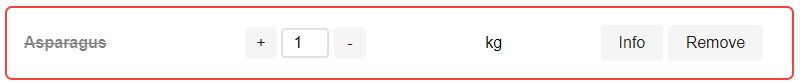

= FEP1 Tentamen 210607
:icons: font 
ifdef::env-github[]
:tip-caption: :bulb:
:note-caption: :information_source:
:important-caption: :heavy_exclamation_mark:
:caution-caption: :fire:
:warning-caption: :warning:
endif::[]

image::assets/hu-logo-nl.svg[]

= FEP1 Tentamen - Voorraadbeheer
__maandag 7 Juni 2021__

== Puntjes vooraf
- Open link:https://teams.microsoft.com/l/meetup-join/19%3ameeting_ZWJkODliYzgtZDNjMC00NDE1LWI2NmEtMWI2NWFiOTcxNDBl%40thread.v2/0?context=%7b%22Tid%22%3a%2298932909-9a5a-4d18-ace4-7236b5b5e11d%22%2c%22Oid%22%3a%22f85a4f5b-1753-4f36-9859-6c1330cbfc1b%22%7d[deze MS-Teams bijeenkomst] en hou in elk geval de chat van dit kanaal gedurende het tentamen open. 
Mochten er onverwacht problemen zijn met het tentamen, dan geven we via dat chat aan en wat je moet doen om dat op te lossen. Gebruik dit chat kanaal echter niet voor discussie etc. Het is uitsluitend bedoeld om vragen aan ons te stellen (waarna we de vraag beantwoorden (in een privé meeting)), of om aanwijzingen van ons te kunnen ontvangen.

- Om de verleiding of om de kans op plagiaat te verlagen willen we je vragen om uit te loggen uit bijvoorbeeld Discord. Als we wel plagiaat constateren moeten we dit bij de examencommissie melden en die bestraffen dit zwaar met bijvoorbeeld uitsluiting van ALLE tentamens voor een blok of meerdere blokken!

- De reguliere tentamentijd voor dit tentamen is 2,5 uur. Op de GitHub server staat een deadline ingesteld. Na het verstrijken van de deadline kun je weliswaar nog steeds naar de repository pushen, maar we zullen pushes na de deadline niet mee nemen in de beoordeling. We adviseren je om na elke opdracht te committen en te pushen. Je bent zelf verantwoordelijk voor de code die je hebt ingeleverd.

- Aanpassingen aan de code dien je uitsluitend te beperken tot de bestanden in de map `/public/`, op de aangewezen locaties in de opdracht. Aanpassingen aan de server en of andere functies zorgen dat de opdracht niet uitgevoerd kan worden en leveren zodoende geen punten op!!!

- Verder dien je geen nieuwe tools / libraries zoals bootstrap, jquery, lodash, moment.js etc aan het project toe te voegen. Zie vorige punt.

- Clone het project en voer `npm install` uit. Voer daarna `npm run server` uit en via `http:\\localhost:4000` hoor het volgende te krijgen:
+
.Index pagina aan het begin van het tentamen

Als dit niet het geval is, controleer of npm server is gestart en je in de browser de juiste poort hebt meegegeven. Zie voor meer informatie de FAQ beneden.

TIP: De opdrachten hebben geen afhankelijkheid. Sla een opdracht over als je vastloopt. 

== De beoordeling ==
Bij elke opdracht staat aangegeven op welk lesonderdeel de opdracht betrekking heeft (JS, HTML, CSS en WEB). Voor elke opdracht scoor je een geheel cijfer (0-10) waarbij we in de beoordeling gebruik zullen maken van de volgende beoordelingsmatrix:

.Tabel Beoordelingsmatrix
|===
| werkende opdracht | 50% van het opdrachtcijfer | wordt altijd beoordeeld met werk wel / niet
| commentaar bij de opdracht | 20% van het opdrachtcijfer | wordt altijd beoordeeld
| optimale code | 20% van het opdrachtcijfer | heb je bijvoorbeeld omslachtig geprogrammeerd en kon het efficienter? Heb je rekening gehouden met uitzonderingen? Dit onderdeel wordt alleen beoordeeld als aan eerste twee onderdelen (werkende opdracht en commentaar) is voldaan.
| kwaliteit | 10% van het opdrachtcijfer | Hier zijn de 2 documenten omtrent de coding standaards leidend (zoals het gebruik van CamelCase). Dit onderdeel wordt alleen beoordeeld als aan de eerste twee onderdelen is voldaan.
|===

NOTE: Wil je per opdracht een voldoende scoren,  dan moet die dus minimaal werken en van commentaar zijn voorzien!!!

Het commentaar dient niet heel erg uitgebreid te zijn, maar moet ons duidelijk maken dat je door hebt wat je hebt gedaan en waarom je het zo hebt gedaan (geldt ook voor de HTML en CSS opdrachten!!!). Beschrijf hoe je het aan ons zou uitleggen als wij om uitleg vragen.

Met de examencommissie is afgestemd dat het ons vrij staat om bij verdenking (of twijfel) op plagiaat, de betreffende student(en) voor een gesprek uit te nodigen. 

WARNING: **LET WEL: Indien we plagiaat constateren moeten we dit melden aan de examencommissie en daar staan zware sancties op!!!**

Dus weersta de verleiding om snel even iemand te vragen om je te helpen en maak de opdrachten zelf. Daarbij heb je de kennis volgend jaar nodig bij FEP2.

De opdrachten wegen niet allemaal even zwaar mee in het eindcijfer. 
Het eindcijfer is het gemiddelde van de cijfers van alle opdrachten bij elkaar opgeteld, waarbij de JS & WEB opdrachten een gewicht van 2 hebben en de HTML en CSS opdrachten een gewicht van 1 (zodoende correspondeert dit met het aantal lesweken van dat onderwerp).
Je eindcijfer wordt dus als volgt berekend:

  eindcijfer = (
      2 * SOM(opdracht cijfers JS opdrachten) / aantal JS opdrachten + 
      SOM (opdracht cijfers HTML opdrachten) / aantal HTML opdrachten + 
      SOM (opdracht cijfers CSS opdrachten) / aantal CSS opdrachten + 
      2 * SOM (opdracht cijfers WEB opdrachten 
      ) / aantal WEB opdrachten) / 6

== De opdrachten
In elk van de bestanden die je voor de opdrachten moet aanpassen zie je bovenin een commentaarblok waar jij je naam en studentennr dient in te vullen. Dit zijn de volgende bestanden:  

* /public/src/index.html
* /public/src/view/style/table.css
* /public/src/view/dom_manipulation.js
* /public/src/view/stock_manipulation.js

=== CSS Opdrachten
De CSS opdrachten hebben allemaal betrekking op het bestand `table.css`.
Vergeet niet bij de wijzigingen voor elke opdracht ook commentaar te plaatsen waarin jij je wijzigingen toelicht.

. *[CSS] Selector:*
Als de checkbox (Currently for sale) niet geselecteerd is, zul je ook ingredienten zien waarvan het seizoen al afgelopen is of nog moet beginnen. Deze zijn nu niet beschikbaar.
Om de lijst zelf visueel duidelijker te maken dat deze ingredienten nu niet beschikbaar zijn, willen we dat deze worden doorgestreept zoals weergegeven in onderstaande afbeelding. (De rode rand in deze afbeelding zul je in de eerste WEB opdracht toe gaan voegen).
+
.Ingredient waarvan het seizoen nog niet is begonnen of al is afgelopen

Voeg de code toe in het CSS bestand om deze tekst door te strepen.

. *[CSS] Responsive design:*
Het woord Ingredients staat nu gecentreerd. Echter we willen graag dat het woord links komt te staan als het scherm 960 of meer horizontale pixels beschikbaar heeft.
Voeg de hiervoor vereiste code onder aan het CSS bestand toe. 

. *[CSS] Responsive design / Grid:*
Elke rij in de tabel is als een grid gedefinieerd. De huidige opmaak, waarin de info en remove button onder het ingredient staan, is prima voor een klein scherm. Voor grotere schermen (vanaf 768 pixels horizontale breedte) zou de opmaak er als volgt moeten uitzien: 
+
.Opmaak van een ingredient vanaf 768 pixels

Voeg de hiervoor vereiste code onder aan het CSS bestand toe.

=== HTML Opdrachten
Deze opdracht heeft betrekking op het index.html bestand.

. *[HTML] Forms:*
Het formulier voor het toevoegen van een nieuw ingredient (aan het voorraadbeheer systeem) is nog niet af, terwijl de JavaScript code die het formulier uit moet lezen en versturen dat wel is. +
Zorg dat via het `add-form` formulier dit mogelijk wordt en er als volgt uit komt te zien:
+
.Add ingredient formulier

Hou hierbij rekening met onderstaande voorwaarden, mede om de code werkende te houden. Zo geldt er dat name attribuut van de velden overeen moet komen met:
+
.Tabel name attribuut waarden
[cols=2*, options="header"]
|===
| Veld | name attribuutwaarde
| Product name | title
| Unit | unit
| Available | available
| Minimum | minimum
| Optimum | optimum
| Available in season | available-season
| Average price per unit | average-price-per-unit
|===
De selectiebox voor de unit dient verder een keuze te bieden uit (met de waarde van de keuze tussen ronde haken): 
** Kilo (kg)
** Gram (gram)
** Liters (liters)
** Units (units)

+
Uiteraard zijn alle velden verplicht en zouden de ingevulde getallen niet negatief mogen zijn. +
Na het drukken op de knop wordt het ingredient toegevoegd. NB: dit is een HTML-opdracht.

=== JS Opdrachten

. *[JS] String manipulatie:*
De data die we van de server terugkrijgen bevat geen netjes opgemaakte naam voor het ingredient. De naam van het ingredient is nu in de 'key' verwerkt als een enkel woord zoals bijvoorbeeld `french_fries`. We willen graag dat de naam van elk ingredient begint met een hoofdletter en dat de underscore wordt vervangen met een spatie (dus `French fries` ipv `french_fries`).
Pas in het bestand `dom_manipulation.js` de functie `toTitle` aan zodat deze altijd een netjes opgemaakte naam van het ingredient terug geeft.

. *[JS] JS Arrays:*
In het bestand `stock_manipulation.js` vind je de functie `getTotalPrice`. Deze functie berekent de prijs van de boodschappenlijst, om alle weergegeven producten (met uitzondering van de producten die buiten het seizoen vallen zoals Asperges) weer aan te vullen tot een optimale voorraad. Deze prijs wordt vervolgens aan de rechter kant van het scherm wordt weergegeven. Bij de initiale dataset zou deze €91.22 moeten zijn als de filter 'only low availability' uit staat en heeft de filter 'currently for sale' geen effect. En als de filter 'only low availability' wel aan staat zou die de prijs €79.6 moeten tonen.

=== WEB Opdrachten

. *[WEB] DOM Manipulatie:*
We willen graag visueel zien van welke producten de voorraad kleiner is dan de gegeven minimum voorraad, door die rij een rood randje te geven. De CSS voor de rode rand is al gedefineerd in de style 'low-on-stock'.
Geef in het bestand `dom_manipulation.js` de code voor de methode `markLowOnStock` om dit te realiseren.

. *[WEB] Dialog:*
In het bestand `dom_manipulation.js` vind je twee functies `openModal` en `closeModal`. De `openModal` functie wordt door de click eventhandler van de Info button aangeroepen en zou de dialogbox van dat ingredient als modal venster moeten openen. De eventhandler van de `close` button binnen dialogbox zou dit venster weer moeten sluiten.
Geef de hiervoor benodigde code.
+
TIP: Bekijk even goed in de DevTools van je browser hoe een rij in de tabel is opgebouwd.

. *[WEB] EventHandler:*
Op dit moment werken de `+` en `-`, als ook de `Remove` button nog niet, omdat deze knoppen nog niet aan een EventHandler gekoppeld zijn. Wel is er al een enkele eventHandler methode die we voor alle knoppen zouden gebruiken (`handleButtonClick`) [zie het bestand `dom_manipulation.js`]. +
Er is een begin gemaakt met de methode `attachInfoButtonEventListeners`, maar bij een code review is gebleken dat de manier die we in de methode `attachInfoButtonEventListeners` hanteren omslachtig is (deze methode hadden we alvast neergezet om de dialog venster WEB opdracht te kunnen testen). 
De methode `attachButtonEventListeners` moet steeds worden aangeroepen per knop. Schrijf de code die zorgt dat de knoppen gebruik maken van de methode `attachButtonEventListeners` en dit op een efficiente manier doet. De methode `attachInfoButtonEventListener` wordt zodoende overbodig.

== Project setup ==

Dit project maakt net als in de opdrachten in de les gebruik van een backend server die geschreven is in Node.JS.
Installeer dus als eerste even de benodigde pakketten door in de rootdirectory van je project het commando `npm install` te runnen.

Hierna kun je de server starten met `npm run server`

De server zelf draait op poort 4000 en kent de volgende REST API:

.Table REST API
[cols=3*, options="header"]
|===
| Methode | URL | Beschrijving
| GET | http://localhost:4000/v1/ingredient | Gets an array of all ingredients
| GET | http://localhost:4000/v1/ingredient/{key} | Gets a single ingredient specified by its key value. In case that no ingredient with this key could be found, a 404 error will be returned.
| POST | http://localhost:4000/v1/ingredient/{key} | A single ingredient specified by its key value will be added. The ingredient data to be added is expected to be formatted as JSON. In case there already is an ingredient with this key, a 409 error will be returned.
| PUT | http://localhost:4000/v1/ingredient/{key} | A single ingredient specified by its key value will be updated. The ingredient data to be updated is expected to be formatted as JSON. In case that no ingredient with this key could be found, a 404 error will be returned.
| DELETE | http://localhost:4000/v1/ingredient/{key} | A single ingredient specified by its key value will be deleted. In case that no ingredient with this key could be found, a 404 error will be returned.
| GET | http://localhost:4000/v1/reset | ( __Meant for development only__ ) Will reset the database at the server by populating the database with dummy data.
|===


== FAQ

=== De server geeft een foutmelding bij het starten

Als je de foutmelding in het begin er zo uit ziet:
```
$ npm run server

> tentamen-210607@1.0.0 server
> node server/server.js

node:events:353
      throw er; // Unhandled 'error' event
      ^

Error: listen EADDRINUSE: address already in use :::4000
    at Server.setupListenHandle [as _listen2] (node:net:1295:16)

...
```
Dan zie je bij de error `address already in use :::4000` staan. Je hebt al een server op deze poort (4000) draaien. Stop dus eerst de andere server en start dan de server opnieuw.
Als de andere server geen FEP1 server blijkt te zijn of je deze niet gestopt krijgt, start dan de server met de `-p` optie op een andere poort (`npm run server -- -p {poortnr}`).

=== Hoe moet ik tentamen inleveren?

Als het goed is heb je dit tentamen (zoals we dat ook vanaf de eerste les met de oefeningen doen) gecloned (`git clone ...`). Dit maakt dat git weet waar je online repository staat.
Om nu code online in te leveren moet je een aantal stappen doorlopen:
[start=1]
. `git add *` om alle op dat moment gewijzigde files aan de volgende commit actie toe te voegen.
. `git commit -m "{commit message}"` om de gewijzigde bestanden aan de lokale repository toe te voegen of de wijzigingen lokaal op te slaan.
. `git push -u origin main` om alle commits van je locale repository naar de server te pushen.
Controlleer voor de zekerheid met de browser op je GitHub repository dat de wijzigingen er staan.

TIP: Voer deze acties geregeld uit, bijvoorbeeld na elke opdracht die je af hebt (no worries, je kunt je antwoorden met een volgende commit gewoon bijwerken als je ontdekt dat er toch nog iets niet goed was). Door regelmatig te committen voorkom je stress, mocht je computer ineens aan het einde van het tentamen gek doen of crashen.

Aan deze classroom assignment repository is een deadline gekoppeld. Committen na de deadline is mogelijk (tot dat we jullie de rechten op deze repo ontnemen), maar wordt door classroom aangegeven als zijnde te laat ingeleverd.

=== De site werkt ineens niet meer?

Open de console van de dev-tools van je browser. Wellicht zie je daar een error staan, die je eerder niet had. JavaScript stopt met het runnen als het errors tegenkomt die je niet afvangt en dat maakt dat je code niet meer werkt.
Een veel voorkomend probleem is hierbij dat je IDE soms denkt dat je een import bent vergeten te specificeren en deze voor je in de code plaatst. Vaak zijn dat imports die betrekking hebben op JavaScript gebruik in de BackEnd (NodeJS), zoals een import van bijvoorbeeld 'Express'. De bestanden zijn echter niet voor de front-end bedoeld en maken dat er een error ontstaat die je code laat crashen.
Door aan het begin van je source code te kijken of de imports wel kloppen (overeen komen met de oorspronkelijke code van je github repo) kun je dit probleem makkelijk zelf snel verhelpen.

=== De site ziet er anders uit dan op de screenshot van wat ik had moeten zien.

Benader vanuit de browser een van de GET REST API's van de server; bijvoorbeeld: http://localhost:4000/v1/ingredient 

NOTE: We benaderen hier onze server op de poort 4000, de poort die we als standaard poort voor onze webserver hebben gekozen, mocht je een andere poort hebben gekozen, dan moet je dat nummer in de URL invullen.

Als het goed is zou je dan een JSON object terug moeten krijgen. De server is online en werkt.
Controlleer vervolgens in de omnibox van je browser het poortnummer van de URL die je gebruikt om de website te openen. Is dat dezelfde poortnummer dan die die je zonet gebruikt hebt voor het benaderen van de REST API (bijvoorbeeld 4000) of gebruikt die een andere poortnummer.
Als je hier een andere poort gebruikt, dan draait je front-end op een andere webserver dan je back-end. Heb je bijvoorbeeld de website vanuit Visual Studio Code via de liveserver geopend?.
In dat geval ontstaan er bij de JS fetches in de code CORS errors bij het benaderen van de REST API, waardoor je site er anders uit komt te zien.
Luisteren de website en je REST API naar dezelfde poort, dan hoor je geen problemen te krijgen. 
